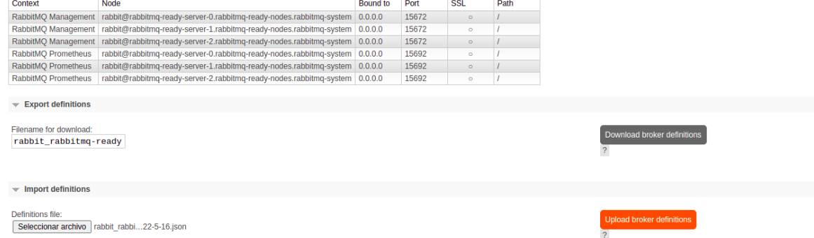

<h1 id="rabbitmq">Cluster Rabbitmq</h1>

### Install Rabbitmq Operators

```bash
$ kubectl apply -f https://github.com/rabbitmq/cluster-operator/releases/latest/download/cluster-operator.yml
```

### Install PriorityClass

```bash
$ kubectl apply -f ./rabbitmq/high-priority.yaml -n rabbitmq-system
```

### Install Cluster Operator Rabbitmq

```bash
$ kubectl apply -f ./rabbitmq/rabbitmq-cluster.yml -n rabbitmq-system
```

### Delete Cluster Operator Rabbitmq

```bash
$ kubectl delete -f  ./rabbitmq/rabbitmq-cluster.yml -n rabbitmq-system
```

### Port Forward al service de rabbitmq

```bash
$ kubectl port-forward svc/rabbitmq-ready 45672:15672 4672:5672 -n rabbitmq-system
```

### Obetner user y password por default

```bash
$ kubectl get secret rabbitmq-ready-default-user -o jsonpath='{.data.username}' -o go-template="{{.data.username | base64decode}}" -n rabbitmq-system
$ kubectl get secret rabbitmq-ready-default-user -o jsonpath='{.data.password}' -o go-template="{{.data.password | base64decode}}" -n rabbitmq-system
```

### Delete Cluster Rabbitmq

```bash
$ kubectl delete -f ./rabbitmq/rabbitmq-cluster.yml -n rabbitmq-system
```

### Import Broker Definitions



### References

[Rabbit Cluster Operation](https://github.com/rabbitmq/cluster-operator)

[Rabbit Create Cluster](https://github.com/rabbitmq/cluster-operator/tree/main/docs/examples/production-ready)

[Definition Cluster Operation](https://www.rabbitmq.com/kubernetes/operator/using-operator.html)